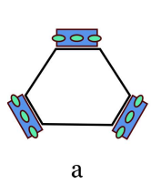
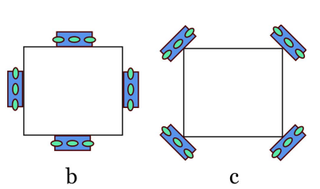
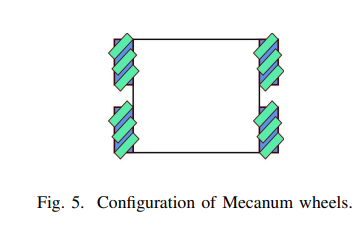
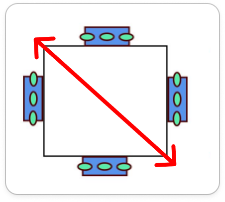

# Cinemática

## Definir configuração das rodas do robô

### Possíveis configurações do robô omnidirecional 
 
Vamos trabalhar com robôs holonomicos: Não tem restrição de movimento. Ele pode ir para qualquer lugar a qualquer instante. Pode ter 3 rodas ou 4 rodas 

#### Configuração do robô com 3 rodas

Três rodas omni montadas em uma configuração triangular com seus eixos inclinado em 120 graus em relação entre si:

#### Configuração do robô com 4 rodas

Rodas omni simétricas em 90 graus. Configuração '+' em b e 'x' em c:

Rodas mecanum como se fosse um carro:

#### Comparação entre 3 rodas e 4 rodas em 'x' 
> Referência: Modeling and Assessing of omni-directional robots with three and four wheels 

|  | Número de rodas | Tipo de rodas | Prós pro SSL | Contras pro SSL |
|---|---|---|---|---|
| Omni | 3 | Omni | Cria 3 pontos de contato (um plano) com mesma pressão nas rodas. Precisa de menor corrente pra atingir velocidade máxima que 4 rodas | Aceleração menor que 4 rodas |
| Omni | 4 | Omni | Aceleração bem mais rápida | Consome mais potência. Pode precisar de suspensão pra compensar a roda que fica suspensa e garantir pressão igual nas rodas que ficam no chão |
| "Carro" | 4 | Mecanum |  | Pode não caber bem dentro do cilindro limite da categoria. Qualquer espaço é sagrado |

*Observação:* 

É possível usar rodas mecanum em robôs omni na configuração de 3 rodas e 4 rodas. Porém a roda mecanum pode gerar uma limitação na movimentação do robô que deve ser considerada no projeto do controle do robô. Também não foram encontrados exemplos usando algo assim, então pra ter certeza que funcionaria no SSL teria que fazer algum estudo primeiro.  

### Configuração escolhida e justificativa 

#### Configuração de 4 rodas omnidirecionais

##### Motivos: 

1. Tem espaço pro sistema de chute, como indicado na figura pela seta vermelha 
2. Permite "esconder" as rodas com a camisa do robô  
3. Aceleração maior com 4 rodas indica que robô vai ser mais rápido para chegar na bola, pra defender a área aliada, etc 

## Formulação matemática

<!-- TODO: incluir formulas da cinematica do robo  -->