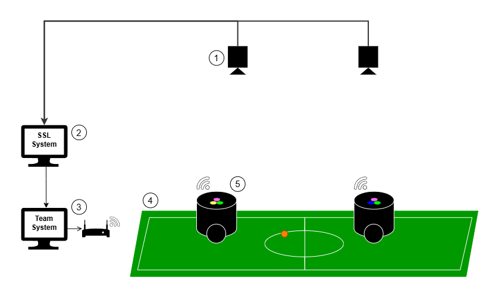

# Design do sistema 

<!-- TODO: incluir link para o material das equipes  -->
O sistema é desenvolvido seguindo as regras da categoria [Robocup Small Size League](https://robocup-ssl.github.io/ssl-rules/sslrules.pdf ). Além do que foi feito por outras equipes que participam da categoria há mais tempo tais como Tigers, Robocin, ITA, entre outras.

Diante desse cenário, temos que o sistema pode ser representado da seguinte forma:

O sistema conta com:

1 - Sistema de Visão

- Duas câmeras posicionadas acima do campo
- Software de visão computacional unificado, que processa as informações lidas pelas câmeras e envia para os Sistemas de Software das equipes

2 - Sistema SSL

- Consiste do Software de Visão Computacional e do Game Controller

3 - Sistema de software da Equipe

- Recebe as informações processadas pelo Sistema de Visão. No caso da Equipe UnBall, ao receber as informações, processa a navegação e decide a ação de cada robô do time naquele momento. A decisão é enviada, então, para cada robô via comunicação wireless. No desenho, essa comunicação se dá por WiFi, mas pode ser de outros tipos desde que atenda às regras da categoria.

4 - Campo

- O campo é feito de carpete e segue as regras definidas pela Robocup. 
- A bola é uma bola de golfe laranja
- Os gols, que não foram desenhados no diagrama acima, devem ser brancos e de dimensões de acordo com as regras da categoria.

5 - Robôs

- Os robôs compõe o time e, de acordo com as regras, possuem restrições em tamanho de 18cm de diâmetro e 15cm de altura. Eles recebem as ações decididas pelo Sistema da Equipe e atuam para tal. Além de se movimentar para o local decidido, eles podem chutar e driblar. Os robôs da UnBall apenas movimentam e chutam com força máxima. 