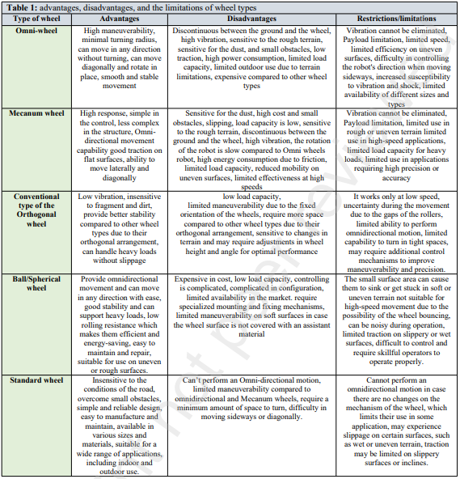
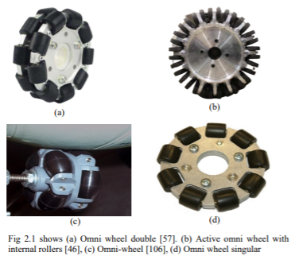
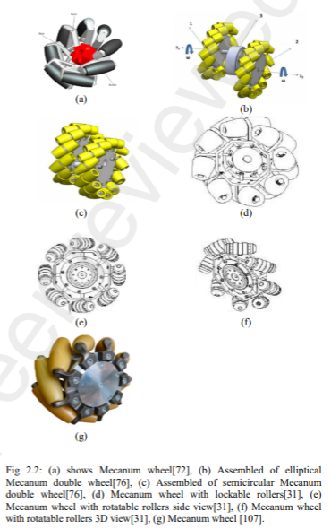
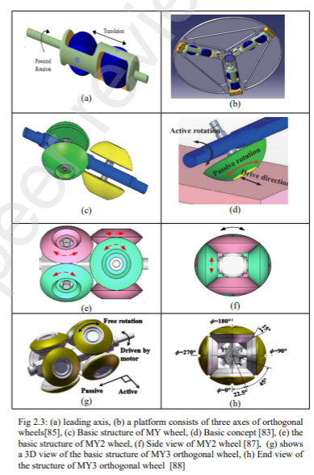
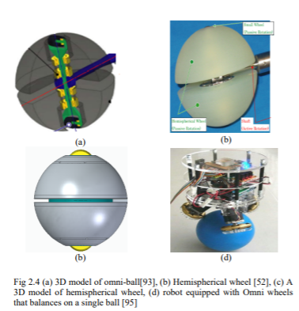
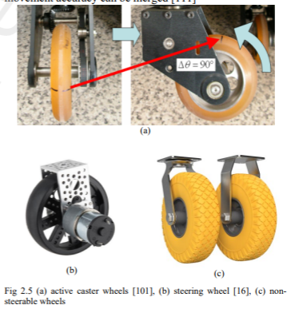

# Tipos de rodas para robôs omnidirecionais 

## Comparação entre os tipos de rodas: 
> Fonte: A Comparative Review of Omnidirectional Wheel Types for Mobile Robotics 

 
### Roda omnidirecional 

### Roda mecanum

### Roda ortogonal 

### Roda esférica  

### Roda tradicional 
