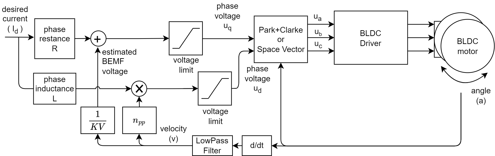

# Controle do motor

## Primeiro passo: controle do torque

https://docs.simplefoc.com/voltage_torque_mode
Precisa encontrar os seguintes valores: https://docs.simplefoc.com/bldcmotor

- numero de polos do motor

- indutância L

- KV

- phase resistance 

https://github.com/makerbase-motor/MKS-ESP32FOC/blob/MKS-ESP32-FOC-V1.0/Test%20Code/7_current_control_example/7_current_control_example.ino

https://docs.arduino.cc/software/ide-v2/tutorials/ide-v2-serial-plotter/

https://docs.simplefoc.com/code